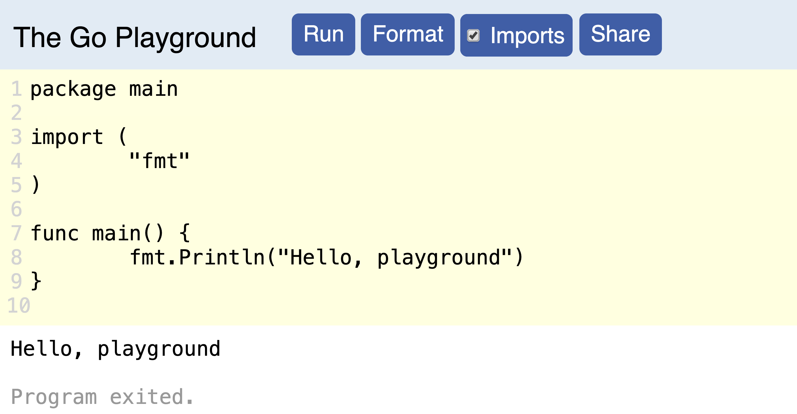
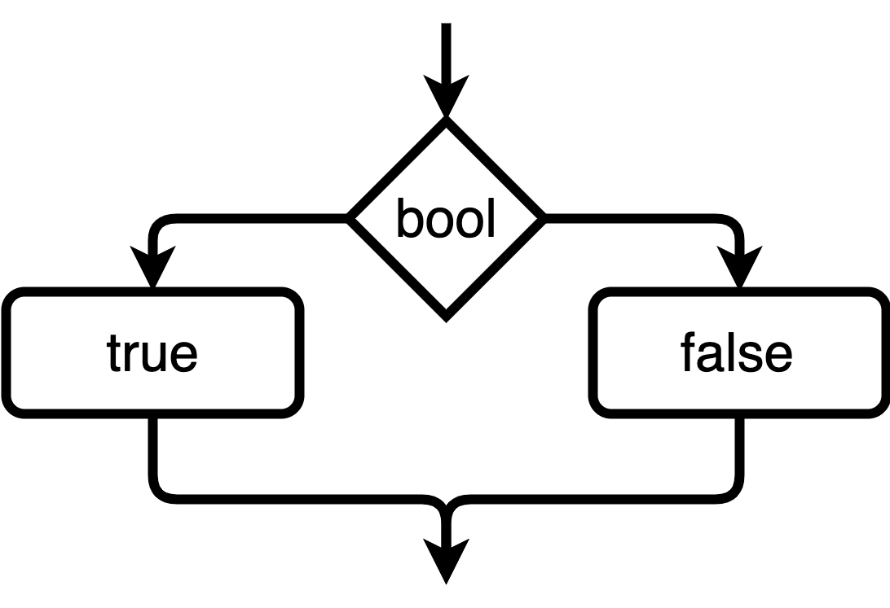
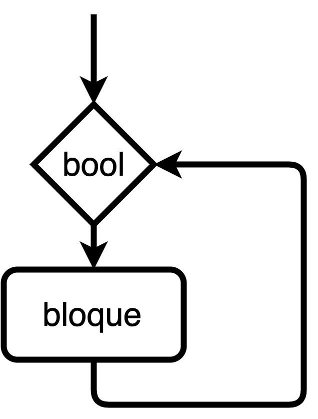

# El primer programa

## El *playground* de Go

Go se puede instalar en nuestro ordenador y con ayuda de un editor de texto podemos crear todo tipo de programas. Sin embargo no es necesario instalar nada para comenzar a estudiar Go. Basta introducir en un navegador la dirección:

> [https://play.golang.org/](https://play.golang.org/)

y comenzar a escribir nuestros programas. Una vez terminado el programa pulsamos el botón **Run** y nuestro programa se ejecuta.



El programa que aparece por defecto al visitar la página nos permite imprimir texto por pantalla. El texto que queremos mostrar se escribe dentro de comillas dobles. Dichas comillas no aparecen al ejecutar el programa y simplemente sirven para delimitar la cadena de texto que deseamos imprimir.

## Estructura inicial de un programa

El programa que aparece por defecto en el Playground realiza ya alguna acción, que consiste en escribir por pantalla una frase. Sin embargo podemos borrar partes del programa sin obtener errores. Pero no podemos borrar todo. Existen ciertas partes que todo programa en Go debe poseer:

* Todo programa en Go comienza con la sentencia `package`. En este caso al tener un único archivo, este archivo es el principal (*main* en inglés). Por lo tanto la primera línea es `package main`. 

* Todo paquete principal debe tener una función principal, llamada `main()`. El contenido de la función `main()` debe ir entre llaves. Para indicar que `main()` es una función utilizamos la palabra clave (*keyword* en inglés) `func`. 

Este es el programa mínimo en Go y no hace absolutamente nada.

```go
package main
func main(){
}
```

## Ejercicios

### Modificar el Playground

Cada vez que entramos en el Playground tenemos un programa escrito que podemos modificar. Realiza cambios en dicho programa para que imprima tu nombre. 


### Escribir dos líneas

Intenta modificar el programa del Playground para que imprima dos líneas de texto.


## Ejercicios opcionales

### Compartir programas del Playground

Una vez terminado el programa pulsa el botón **Share**. En la barra de direcciones aparece una nueva dirección. Copia dicha dirección y ya puedes enviar dicho enlace. También puedes guardar dicho enlace en un documento de texto y de esta forma puedes tener acceso a todos los programas que vayas creando.

### El tour de Go

Existe un tutorial interactivo para aprender Go, llamado el **tour de Go**. La versión más actualizada de este tutorial está en inglés en la dirección:

> [Tour de Go](https://tour.golang.org/welcome/1)

También existe una versión en español, aunque no está tan actualizada: 

> [Una visita por Go](https://gotour-es.appspot.com/#1)


### Visitar la página del lenguaje

La dirección de la página web del lenguaje es

> [golang.org]()

En ella podremos descargar Go a nuestro ordenador, consultar la ayuda del lenguaje e informarnos de todas las novedades referentes a este lenguaje.


# Imprimir por pantalla.

## La función `Println()`

Si queremos imprimir una frase por pantalla podemos utilizar la función `Println()`  contenida en el paquete `fmt`. Esta función debe ir dentro de la función `main()`. La frase que queramos mostrar por pantalla debe ir entre **comillas dobles** y dentro del paréntesis de la función `Println()`. Además si queremos trabajar con la función `Println()` debemos **importar**  el paquete que la contiene, llamado `fmt`.  Esto se consigue con la sentencia `import` y escribiendo entre comillas dobles el nombre del paquete.


Este primer programa imprime la frase `Hola mundo` al ejecutarse. A partir de ahora pondremos el código de un programa y justamente debajo la salida que produce dicho código.

```go
package main
import "fmt"
func main() {
	fmt.Println("Hola mundo")
}
```

---

```tex
Hola mundo
```

## Imprimir varias líneas

Si queremos imprimir varias líneas tenemos varias alternativas que analizamos a continuación. 

1.- La más sencilla es utilizar varias veces la función `Println()`.

```go
package main
import "fmt"
func main() {
  fmt.Println("Primera frase")
  fmt.Println("Segunda frase")
}
```

---

```tex
Primera frase
Segunda frase
```

2.- Si queremos que en el resultado del programa nos aparezca un salto de línea, no basta con añadir un salto de línea en la frase, puesto que eso daría lugar a un error al intentar ejecutar el programa.

```go
package main
import "fmt"
func main() {
  fmt.Println("Primera línea
              También primera línea")
}
```

---

```tex
./prog.go:4:30: newline in string
./prog.go:4:30: syntax error: unexpected newline, expecting comma or )
./prog.go:5:40: newline in string
```

En Go, y en muchos lenguajes, han optado por una solución elegante: utilizar los llamados **caracteres de escape**. Si en una cadena de texto escribimos `\n` al imprimir dicha cadena Go cambia ese par de caracteres por un salto de línea.

```go
package main
import "fmt"
func main() {
  fmt.Println("Primera frase\nSegunda frase")
}
```

---

```tex
Primera frase
Segunda frase
```

La combinación de la barra inclinada `\` junto con alguna letra se denominan caracter de escape y puede ejecutar distintas acciones.

3.- También podemos utilizar las comillas graves para delimitar el texto. Si escribimos texto entre comillas de este tipo los caracteres de escape no se interpretan y todos los saltos de línea que creemos con el teclado se escriben de manera literal.

```go
package main
import "fmt"
func main() {
  fmt.Println(`Primera frase\n
  Segunda frase
  
  Los caracteres de escape \t no funcionan.`)
}
```

---

```tex
Primera frase\n
  Segunda frase
  
  Los caracteres de escape \t no funcionan.
```

## Ejercicios

### Imprimir nombre y apellidos

Imprime por pantalla tu nombre y tus apellidos en una única línea. 


### Imprimir en varias líneas

Imprime tu nombre y tus apellidos en distintas líneas utilizando las diversas formas vistas en el texto.


### Imprimir comillas dobles

Si intentamos imprimir unas comillas dobles dentro de una cadena obtenemos un error, pues las comillas sirven para delimitar la cadena. Si dentro de una cadena escribimos `\"` cuando imprimimos la cadena aparece solamente la comilla doble. Este es un nuevo caracter de escape.

```go
package main
import "fmt"
func main() {
  fmt.Println("El mejor lenguaje es \"Go\" y punto")
}
```


## Ejercicios opcionales

### El caracter de escape `\t`

La combinación de caracteres `\t` ejecuta una acción sobre el texto. Inserta varias veces dicho caracter de escape e intenta deducir cual es su función.


### La función `Print()`

La función `Print()` es muy similar a la función `Println()`, pero con la diferencia de que no crea un salto de línea después de ejecutarse. Escribe el siguiente programa y comprueba lo dicho. Se suele usar mucho menos que la función `Println()`.

```go
package main
import "fmt"
func main() {
	fmt.Print("Primera línea.")
	fmt.Print("Me temo que también primera línea.")
}
```


# Operaciones aritméticas

## Escribir texto y números

Si lo que queremos es imprimir un número, entonces podemos escribir el número, pero **sin utilizar las comillas**.

```go
package main
import "fmt"
func main() {
	fmt.Println(2019)
}
```

---

```tex
2019
```

Si como argumento de la función `Println()` escribimos una operación con números, entonces lo que nos muestra por pantalla es el resultado de la operación.

```go
package main
import "fmt"
func main() {
	fmt.Println(2019 - 49)
}
```

---

```tex
1970
```

En definitiva, el texto debe ir entre comillas y los números sin ellas. Podemos imprimir ambas cosas separándolas por una coma.

```go
package main
import "fmt"
func main() {
	fmt.Println("Mi fecha de nacimiento es", 2019 - 49)
}
```

---

```tex
Mi fecha de nacimiento es 1970
```

### Operaciones con enteros

Los números enteros son aquellos que no tienen punto decimal. Go puede realizar todo tipo de operaciones entre estos números. Sin embargo se presentan algunas particularidades en su uso que es conveniente conocer.

Para realizar la suma, la resta y la multiplicación se utilizan los operadores habituales en informática, que son `+`,  `-` y `*`.

Para ahorrar un poco de espacio, a partir de ahora, únicamente presentamos en el código el contenido de la función `main()`.

```go
fmt.Println(34 + 56)
fmt.Println(34 - 56)
fmt.Println(34 * 56)
```

---

```tex
90
-22
1904
```

En principio la suma, la resta y la multiplicación no presentan ningún problema, salvo si utilizamos números muy grandes. En dicho caso Go nos dará un error.

```go
fmt.Println(12345678901234567890 * 1234567890)
```

---

```tex
./prog.go:4:34: constant 15241578751714678875019052100 overflows int
```

La naturaleza de este error la veremos en temas posteriores.

El orden de evaluación de los operaciones por parte de Go es el mismo que en las matemáticas: recordemos que primero hacemos las multiplicaciones y divisiones y después las sumas y las restas. Si queremos cambiar el orden recurrimos a los paréntesis.

```go
fmt.Println(2 + 3 * 6)
fmt.Println((2 + 3) * 6)
```

---

```tex
20
30
```

### La división y el módulo

Si realizamos una división entre enteros nos podemos llevar una sorpresa.

```go
fmt.Println(5 / 2)
```

---

```tex
2
```

La división anterior tiene decimales pero Go no los ha calculado. **Si hacemos una división entre enteros Go calcula el cociente de la división entera**. Esta propiedad puede ser causa de muchos errores si no la conocemos y la manejamos de modo incorrecto.

Ya hemos visto como obtener cociente. En Go existe también una forma de obtener el resto de la división de enteros, utilizando el operador `%`, llamado operador de módulo.

```go
fmt.Println(345 / 43)  // Cociente
fmt.Println(345 % 43)  // Resto
```

---

```tex
8
1
```

### Los números decimales

Los números decimales **se escriben con punto**, como en los países anglosajones. En este caso todas las operaciones, incluida la división, funcionan del modo esperado. 

Para escribir números en notación científica utilizamos la letra `e`, en mayúscula o minúscula, para separar el exponente

```go
fmt.Println(3.23e9)
fmt.Println(2.6E-2)
fmt.Println(0.0031415e3)
```

---

```tex
3.23e+09
0.026
3.1415
```

Los resultados los puede dar en notación científica si los números son lo suficientemente grandes o cercanos a cero.

## Ejercicios

### Operaciones combinadas

Realiza las siguientes operaciones y muestra el resultado.

```tex
a) 45 + 89 * 32
b) 3.141592 * 5 * 5 
c) 1234 * 23
d) (3 + 9) * 4 + 90 * 12.6
```

### Divisiones de enteros

Realiza las siguientes divisiones de números enteros.

```tex
a) 7 / 2
b) 23 / 5
c) 345 / 23
```

### Divisiones de números decimales

Realiza las siguientes divisiones y compara con el ejercicio anterior.

```tex
a) 7.0 / 2
b) 23 / 5.0
c) 345.0 / 23.0
```


## Ejercicios opcionales

### La función `Printf()`

Para mostrar información básica por pantalla nos basta la función `Println()`. Sin embargo la función `Printf()` permite tener mucho más control sobre la salida. En general la función `Printf()` sustituye cada una de las apariciones de `%v` por el valor que colocamos después de la cadena de texto. Se pueden sustituir varias expresiones. 

Analiza el siguiente código y realiza pequeñas modificaciones para comprobar el funcionamiento de la nueva  función.

```go
fmt.Printf("Un salto de línea.\n")
fmt.Printf("La capital de España es %v.\n", "Madrid")
fmt.Printf("Me llamo %v y tengo %v años.", "Rambo", 100)
```


# Los comentarios

Cualquier línea que comience con la doble barra inclinada `//` es tratada por Go como un comentario. Si la doble barra aparece en medio de una línea, todo lo situado a su derecha también es un comentario. Los comentarios los hacen los programadores para saber qué hace el código. El programa funciona exactamente igual con ellos que sin ellos.

```go
package main
import "fmt"
func main() {
	// Calculamos el área de un círculo de radio 7
	fmt.Println(3.141592 * 7 * 7)
}
```

---

```tex
153.938008
```


También existen los comentarios de varias líneas, aunque se usan mucho menos. En este caso debemos comenzar el comentario por `/*` y terminarlo con `*/`.

```go
package main
/* Este es un comentario
que ocupa varias líneas*/
import "fmt"
func main() {
	fmt.Println(3.141592 * 7 * 7)
}
```

---

```tex
153.938008
```

## Ejercicios

### Invalidar partes de un código

La principal misión de los comentarios es **documentar** el código. Los programadores introducen comentarios para que otros programadores que lean su código entiendan de modo más rápido el funcionamiento del código. También es útil para que el mismo programador, pasado el tiempo, entienda mejor que es lo que quiso hacer en ese programa.

Sin embargo también se usa para **deshabilitar** partes de un código, pero sin necesidad de borrarlo. En el siguiente código utiliza comentarios para que solamente se ejecute la segunda línea.

```go
fmt.Println("Esta línea no se debe imprimir")
fmt.Println("Esta línea se imprime")
fmt.Println("Esta línea no debe imprimirse")
```

# Variables I

## Declaración

Podemos considerar que una variable es un nombre que almacena un valor. El valor se almacena físicamente en la memoria del ordenador. Si el valor que almacena es un número entero, entonces Go considera que dicha variable es de tipo `int`.  Si lo que guarda es un número decimal entonces es de tipo `float64`.  Si almacena una cadena de texto entonces su tipo es `string`.

Para almacenar un valor en una variable utilizamos la palabra reservada `var` seguido del nombre de la variable, el tipo de dato, un signo igual y el valor que queremos almacenar. La sintaxis es entonces:

```go
var nombreVariable Tipo = Dato
```

Para imprimir el contenido de una variable por pantalla escribimos el nombre de la variable, **sin comillas**, dentro de la función `Println()`. 

```go
var entero int = 2019
var decimal float64 = 3.141592
var nombre string = "Albert"
fmt.Println(entero, decimal, nombre)
```

---

```tex
2019 3.141592 Albert
```

En realidad el tipo de dato es optativo en la declaración de la variable. El compilador es capaz de inferir (deducir) el tipo de dato a partir de lo que se almacena en la variable. Por lo tanto el siguiente código es equivalente al anterior.

```go
var entero = 2019
var decimal = 3.141592
var nombre = "Albert"
fmt.Println(entero, decimal, nombre)
```

En general suele ser conveniente dejar que Go infiera el tipo de dato.

### Operaciones con variables

Con las variables se pueden realizar exactamente las mismas operaciones que con los números, pero con una limitación importante: **las variables con las que se opera deben ser del mismo tipo**. En caso contrario tendremos un error.

```go
var base = 20
var altura = 10
var area = base * altura
fmt.Println(area)
// Resultado -> 200
```

En este caso las dos variables son de tipo `int` y por eso hemos podido realizar la operación. Si en el código anterior cambiamos el valor de la altura y escribimos, por ejemplo `10.8`, entonces la variable altura es de  tipo `float64` y nos dará error al ejecutar el programa. 

```go
var base = 20
var altura = 10.8
var area = base * altura
fmt.Println(area)
```

---

```tex
./prog.go:8:18: invalid operation:
base * altura (mismatched types int and float64)
```

Como vemos, el compilador nos dice que estamos intentando hacer una operación entre un tipo de dato `int` y un tipo de dato `float64`, lo cual no está permitido.

## Ejercicios

### Declarar sin inicializar

Podemos declarar una variable sin asignarle ningún valor. En este caso le tenemos que informar al compilador del tipo de dato que queremos para dicha variable, pues Go no lo puede inferir. 

Declara variables de los tres tipos estudiados sin asignarles ningún valor. Comprueba que dato guardan en dicho caso. El valor que guardan se llama **zero value** en Go.  Comprueba que el *zero value* del tipo `string` es una cadena vacía.


### Variables que no se  usan

Go es muy estricto con las variables y su uso. Si declaramos una variable, necesariamente tenemos que usarla en algún lugar del programa (es lógico, pues para ello la hemos creado). Si Go encuentra una variable que no se usa da un error.

Crea un programa donde definas una variable pero no la uses en ninguna expresión. Analiza el error del compilador.


### Inferencia de tipos

Si escribimos un número sin decimales Go infiere que el valor es un entero. Pero basta escribir un punto decimal para que Go infiera como tipo `float64`. 

Intenta adivinar el tipo de dato inferido en los siguientes ejemplos:

```go
a := 4
b := 4.
c := 4.0
d := 4.12
```

### Volumen de un cono

Utiliza variables y crea un programa que calcule el volumen de un cono (la fórmula es `V = πr^2h/3` ). Utiliza variables de tipo `float64`. Para ello puedes indicárselo al compilador o también puedes escribir los números con un punto decimal para que Go infiera el tipo `float64`.


### Área de un triángulo

Utiliza variables de tipo `int` y crea un programa que calcule el área de un triángulo (la fórmula es `A = bh/2`). Intenta calcular el área de un triángulo de base 1 y de altura 1. ¿Qué ocurre? 

* Comprueba que el programa siempre falla cuando el resultado del área es un número decimal. 

* Cambia el tipo de dato a `float64`  y soluciona el problema.


### Nombres no permitidos de variables

Los nombres de las variables no pueden ser arbitrarios. Existen varias limitaciones que impone el compilador a dichos nombres. Entre las más importantes tenemos:

* Los nombres de las variables pueden comenzar por una letra, mayúscula o minúscula, o bien por el guión bajo. No pueden comenzar por números. Si se pueden utilizar números en otra parte del nombre.
* Las variables no pueden contener espacios en blanco. Tampoco pueden contener caracteres extraños.
* Existen **palabras reservadas**, como por ejemplo `package` o `func` que no se pueden poner a una variable.

Crea variables con nombres no permitidos y analiza el error que proporciona el compilador.


### Go es sensible a mayúsculas y minúsculas

Go diferencia mayúsculas de minúsculas. Por lo tanto las variables `numero` y `Numero` son totalmente distintas para Go. Compruébalo con el siguiente código.

```go
var numero = 2019
var Numero = 2020
fmt.Println(numero, Numero)
```


## Ejercicios opcionales

### Varias variables en un línea

Se pueden definir varias variables en una única línea. Para ello empleamos la palabra `var`, después los nombres de las variables separados por comas y después del signo igual los valores que queremos almacenar, también separados por comas.

```go
var nombre, edad = "David", 49
fmt.Println(nombre, edad)
```

### Varias variables utilizando paréntesis

Aunque todas las formas vistas de declarar variables son correctas, la mayor parte de los programadores en Go prefieren definir las variables **que tienen alguna relación entre si**, usando una única sentencia `var` y escribiendo entre paréntesis e indentadas las variables, como en el siguiente ejemplo.

```go
var (
	nombre = "Albert"
	apellido = "Einstein"
	edad = 49
)
fmt.Println(nombre, apellido, edad)
```

---

```tex
Albert Einstein 49
```


### Las palabras reservadas en Go

En Go existen 25 palabras reservadas, que **no se pueden usar como nombres de variables**. Estas palabras son:

```tex
break      default      func       interface   select
case       defer        go         map         struct
chan       else         goto       package     switch
const      fallthrough  if         range       type
continue   for          import     return      var
```


# Variables II

## Actualizar el valor de una variable

Como su nombre indica, el contenido de una variable puede cambiar a lo largo de la ejecución del programa. Pero si la variable es de tipo `int` entonces solamente puede contener enteros y lo mismo con el resto de los tipos. Para cambiar el valor de una variable se utiliza el operador de asignación `=`. No podemos emplear la palabra `var` pues en ese caso estaríamos creando de nuevo la variable.

```go
var numero = 2019
fmt.Println(numero)
numero = 2020  // Actualizamos el valor
fmt.Println(numero)
```

---

```tex
2019
2020
```

## Los operadores con asignación

Es muy común en programación actualizar una variable sumando o restando un número a su valor anterior. Esto produce algunos malentendidos, pues su expresión puede ser muy similar a la escritura de las ecuaciones en matemáticas, aunque no tiene nada que ver con ellas.

```go
var x = 10
fmt.Println(x)
x = x + 5
fmt.Println(x)
```

---

```tex
10
15
```

En realidad Go realiza siempre primero la operación situada a la derecha del signo igual. Por lo tanto primero suma el valor de `x` con el 5, lo que da un valor de 15 y después lo almacena en la variable `x`, borrando su contenido anterior.

## Declaración corta de variables

Existe otra forma de declarar variables que emplea menos código y utiliza el operador `:=`. La sintaxis es

```go
variable := Dato
```

En este caso dejamos que Go infiera el tipo de dato. El operador `:=` no puede ser usado para actualizar el valor de una variable. También se pueden definir varias variables en una línea.

```go
numero := 2019  // Tipo int
decimal := 3.1415 // Tipo float64
a, b, c := 12, "Hola", 45.23  // Varias en una línea
```

Como podemos declarar o asignar varias variables en una misma línea, podemos fácilmente intercambiar el valor que tengan dos o más variables. Ahora veamos como se intercambia el valor de dos variables.

```go
a, b := "Antes", "Después"
fmt.Println(a, b)
a, b = b, a  // Intercambiamos los valores
fmt.Println(a,b)
```

---

```tex
Antes Después
Después Antes
```

## Ejercicios

### `:=` no sirve para asignar

El operador `:=` solamente sirve para declarar variables y asignarles un valor. No se puede usar para volver a cambiar el valor de la variable. Si lo intentamos tendríamos dos variables con el mismo nombre. Analiza el tipo de error que produce el compilador al intentar hacerlo.

```go
a := 56
a := 45
```

### Tipos erróneos

Crea una variable que contenga un entero. Después intenta almacenar en dicha variable un número decimal o una cadena de texto y analiza el error que devuelve el compilador. Puedes hacer lo mismo con los otros tipos de datos.

### Variables fuera de `main()`

Dentro de la función `main()` se pueden definir las variables utilizando `var` o bien utilizando `:=`. Fuera de la función `main()` solamente se puede utilizar `var`.

Declara una variable fuera de `main()` con `:=` y analiza el error.

### Operadores de incremento y decremento

En el siguiente código se suma un valor a una variable y se almacena en la misma variable.

```go
var a = 10
a += 5  // Equivale ->  a = a + 5
fmt.Println(a)  // Resultado -> 15
```

Para cada operación aritmética existe un operador similar. Realiza programas donde se usen los operadores `-=`, `*=` y `/=`.

### El operador `++` 

Sumar o restar la unidad a una variable es muy habitual en programación. Existen operadores que realizan esta acción. Basta escribir dicho operador después del nombre de la variable y esta se incrementa o decrementa.

```go
var a = 9
a++  // Equivale -> a += 1
fmt.Println(a)  // Imprime 10
var b = 20
b--  // Equivale -> a -= 1
fmt.Println(b)  // Imprime 19
```


### Área y perímetro de un círculo

Utiliza el método abreviado de creación de variables  para crear un programa que calcule el área y el perímetro de una circunferencia (las fórmulas son `A = πr^2` y `L = 2πr`). No olvides que las variables deben de ser de tipo `float64`, por lo que debes añadir un punto decimal para que Go infiera el tipo correcto.


### Concatenación de cadenas

Aparentemente no tiene ningún sentido sumar dos cadenas de texto. Sin embargo prueba el siguiente código e intenta averiguar para que se utiliza el signo `+` en cadenas.

```go
c1 := "Hola"
c2 := "Mundo"
c3 := c1 + c2
fmt.Println(c3)
```


### Declaración de constantes

Una **constante** es similar a una variable, pero no puede cambiar de  valor. Se declaran de modo parecido a las variables pero utilizando la palabra reservada `const`.  

```go
const pi = 3.141595
fmt.Println(pi)
```

* Crea un programa con una constante de tipo `int` y otra de tipo `string` e imprímelas.
*  Intenta modificar el valor de las constantes y observa el error que devuelve el compilador.


## Ejercicios opcionales

### Intercambiar tres variables

Crea tres variables del mismo tipo e intercambia los valores entre ellas.


### Dirección de memoria de una variable.

Cuando creamos una variable esta se almacena en la memoria RAM del ordenador. La memoria RAM está compuesta por un conjunto de «celdas». Cada celda tiene asociado un número entero, llamado su **dirección**, generalmente escrito en formato hexadecimal. Para ver la dirección en memoria de una variable debemos colocar `&` delante del nombre de la variable. La dirección de memoria de la variable depende del ordenador. También puede ocurrir que al ejecutar dos veces distintas el programa en un mismo ordenador la dirección de la memoria cambie.

```go
var numero = 90
fmt.Println(&numero) // El resultado puede variar
// Resultado -> 0x40e020
```


# Tipos de datos enteros

## Los enteros con signo

Hasta ahora hemos visto tres tipos de datos, pero en Go existen muchos otros tipos. Unos son **simples** y otros **compuestos**. En esta entrada estudiaremos los tipos enteros simples.

Existen varios tipos de datos para guardar números enteros. En realidad se puede hacer todo con el tipo `int`, pero podemos utilizar otros tipos de datos si queremos ahorrar memoria y hacer que el programa funcione más rápido (eso se llama **optimizar** el programa). Para entender esto debemos soltar un pequeño rollo teórico.

El tipo `int` se almacena en la memoria RAM del ordenador utilizando en  general 64 bits para cada uno de los números almacenados. El número mayor que podemos almacenar es entonces `2^63 - 1 = 9223372036854775807`. Este número es enorme y si queremos almacenar números enteros más pequeños podemos utilizar, por ejemplo, el tipo `int8` que ocupa en memoria  8 bits (= 1 byte). El problema es que el número máximo que admite este tipo de dato es 127.

En la siguiente tabla se presentan todos los tipos de datos enteros, indicando el menor y mayor valor que pueden almacenar.

| Tipo    | Tamaño                | Rango                 |
| :------ | :-------------------- | :-------------------- |
| `int8`  | 8 bits                | -128 a 127            |
| `int16` | 16 bits               | -2^15 a 2^15 -1       |
| `int32` | 32 bits               | -2^31 a 2^31 -1       |
| `int64` | 64 bits               | -2^63 a 2^63 -1       |
| `int`   | Depende del ordenador | Depende del ordenador |

Si queremos que Go no infiera el tipo de dato de los enteros, sino que almacene el tipo que nosotros queramos, se lo debemos indicar de modo explícito. Ello se puede hacer indicando el tipo de dato que queremos almacenar en la variable.

Para consultar el tipo de dato de una variable debemos utilizar la función `Printf()` escribiendo como argumentos `%T` y el nombre de la variable. Es una forma un tanto complicada pero no existe en Go ninguna otra forma más sencilla de conseguirlo.

```go
var edad int8 = 49
fmt.Printf("%T\n", edad)
```

---

```tex
int8
```

## Los enteros sin signo

Los números enteros que hemos visto hasta ahora pueden almacenar números positivos y negativos. Sin embargo existen tipos de datos que solamente pueden almacenar números nulos o positivos. De esta forma se puede mejorar un poco el uso de la memoria y sobre todo se puede prevenir que dichas variables almacenen valores negativos. Este tipo de datos se denomina **unsigned** en inglés y son los siguientes.

| Tipo     | Tamaño                | Rango                 |
| :------- | :-------------------- | :-------------------- |
| `uint8`  | 8 bits                | 0 a 255               |
| `uint16` | 16 bits               | 0  a 2^16 -1          |
| `uint32` | 32 bits               | 0 a  2^32 -1          |
| `uint64` | 64 bits               | 0 a 2^64 -1           |
| `uint`   | Depende del ordenador | Depende del ordenador |

```go
var edad uint8 = 49
fmt.Printf("Mi edad es %v y su tipo es %T.\n", edad, edad)
```

---

```tex
Mi edad es 49 y su tipo es uint8.
```

El problema que presenta usar varios tipos de datos es que no podemos hacer operaciones entre tipos de datos distintos. Por ejemplo, si queremos sumar un `int8` con un `int16` nos da un error, aunque desde un punto de vista matemático la operación no presenta ningún problema.

```go
var n1 int8 = 23
var n2 int16  = 23
fmt.Println(n1 + n2)
```

---

```tex
./prog.go:9:16: invalid operation: n1 + n2
(mismatched types int8 and int16)
```

## Cambiar el tipo de dato

Por ello es imprescindible saber como cambiar, generalmente de modo temporal, el tipo de un dato para poder operar con ellos. Pero esto es muy sencillo en Go: la función `int8()` convierte cualquier número a un tipo de dato `int8` y lo mismo con los otros tipos de datos numéricos.

```go
var n1 int8 = 23
var n2 int16  = 23
fmt.Println(int16(n1) + n2)
// Resultado -> 46
```

Debemos tener cuidado al transformar los datos. Si el dato que queremos transformar no es compatible con el tipo de dato de destino se pueden producir errores inesperados. Veamos algunos ejemplos. En particular al transformar un tipo de dato flotante a uno entero se pierden los decimales.

```go
var n1 int16 = 2345
var n2 float64 = 3.141592
n3 := 4567 // Infiere el tipo int
fmt.Println(int8(n1), int8(n2), int8(n3))
// Resultado -> 41 3 -41
```

**Nota.** Debido a todos estos problemas, en un nivel básico es aconsejable utilizar únicamente los tipos `int` y `float64`, dejando siempre que Go infiera los tipos.

## Ejercicios

### Las operaciones con variables enteras dan enteros

Crea dos variables enteras y guarda su suma, su resta, su multiplicación y su división en nuevas variables. Imprime el tipo de las nuevas variables que has creado. Comprueba que la división es siempre de tipo `int` y que nunca tiene decimales. Debemos tener cuidado con esta característica de Go: si las variables son enteras, entonces **la división calcula el cociente de la división, pero no la parte decimal**.

## Ejercicios opcionales

### El tamaño en bytes de una variable

Podemos consultar el tamaño en bytes de cualquier variable con la función `Sizeof()` que pertenece al paquete `unsafe`. De esta forma podemos comprobar el tamaño del dato `int` en nuestra computadora.

```go
package main
import (
	"fmt"
	"unsafe"
)
func main() {
	var a bool
	fmt.Println(unsafe.Sizeof(a))
}
```


### Los alias o sinónimos

El tipo `uint8` tiene como sinónimo o alias `byte` e `int32` tiene como sinónimo `rune`.

```go
var a byte = 23
var b rune = 3456
fmt.Printf("%T, %T\n", a, b)
```

---

```tex
uint8, int32
```

### Convertir a base binaria, octal y hexadecimal

La función `Printf()` tiene multitud de usos. Uno de ellos es escribir números en otras bases utilizando para ello distintos **verbs** (así se llaman en Go). Tenemos que `%b` imprime números en binario, `%o` en octal y `\%x` en hexadecimal. Para el formato decimal habitual empleamos `%d`.

```go
x := 5612
fmt.Printf("%b\n", x) // Binario -> 1010111101100
fmt.Printf("%o\n", x) // Octal -> 12754
fmt.Printf("%x\n", x) // Hexadecimal -> 15ec
```


### Escribir números en otras bases

Podemos escribir números en otras bases. Basta ponerle un prefijo al número: `0b` es el prefijo para la notación binaria, `0o` para la octal y `0x` para la hexadecimal.

```go
b := 0b1110101
o := 0o3421
h := 0x3ac4
fmt.Println(b, o, h) // -> 117 1809 15044
```


# Operadores de comparación

Tenemos seis operadores para comparar valores numéricos, y se presentan en la siguiente tabla:

| `>`  | Mayor que         | `<=` | Menor o igual que |
| -  |-  |  -  | - |
| `<`  | Menor que         | `==` | Igual a |
| `>=` | Mayor o igual que | `!=` | Distinto a |


Cuando realizamos una comparación de dos números, el resultado es siempre `true` o `false`. Esos dos valores forman un nuevo tipo de dato llamado `bool`.

> **Nota.**  El operador para comprobar si dos números son iguales es el doble igual `==` y no lo debemos confundir con el operador de asignación de variables `=`.


```go
fmt.Println(3 < 5)
a := (3 == 5) // Comprobamos si son iguales
fmt.Printf("El valor es %v y su tipo es %T\n", a, a)
```

---

```tex
true
El valor es false y su tipo es bool
```

Si queremos hacer una comprobación con variables en vez de con números literales nos debemos asegurar que ambas sean del mismo tipo. Por ejemplo, el siguiente código produce un error, debido a que ambas variables son de distinto tipo.

```go
a := 4
b := 90.5
c := a < b
fmt.Println(c)
```

---

```tex
./prog.go:6:8: invalid operation:
a < b (mismatched types int and float64)
```

Incluso se producen errores si los números son enteros pero de distinto tipo.

```go
var a int8 = 4
var b int16 = 5
fmt.Println(a < b)
```

---

```tex
./prog.go:6:15: invalid operation:
a < b (mismatched types int8 and int16)
```
## Ejercicios

### Inicialización del tipo `bool`

Si declaramos una variable de tipo `bool` y no le asignamos ningún valor, por defecto Go le asigna el valor `false`.

```go
var logico bool
fmt.Println(logico)
```


### Comparar enteros

Guarda en dos variables los números 4 y 5 y utiliza los seis operadores de comparación entre ambas variables. Utiliza distintos tipos de datos enteros y comprueba que funciona de modo correcto si ambos tipos son iguales y que obtenemos errores en caso contrario.


## Ejercicios opcionales

### Los operadores lógicos

**Nota.- Requiere conocimientos de lógica**

La conjunción lógica `∧`, la disyunción lógica `∨` y la negación `¬` tienen la tabla de verdad:

| p    | q    | p ∧ q | p ∨ q | ¬p   |
| ---- | ---- | ----- | ----- | ---- |
| V    | V    | V     | V     | F    |
| V    | F    | F     | V     | F    |
| F    | V    | F     | V     | V    |
| F    | F    | F     | F     | V    |

En Go el operador de la conjunción es `&&`, de la disyunción es  `||` y de la negación es `!`. Cambiando los valores de las variables en el siguiente código se pueden ver las tablas de verdad de todos los operadores.

```go
p := true
q := false
fmt.Println(p && q)
fmt.Println(p || q)
fmt.Println(!p, !q)
```

### Comparación de cadenas

En principio parece que no tiene mucho sentido comparar dos cadenas. Sin embargo si **las dos cadenas están escritas en minúsculas**, dicho orden tiene algo que ver con el orden lexicográfico (el orden alfabético del diccionario). Escribe el siguiente código y cambia el valor de las variables para comprender mejor su funcionamiento.

```go
a := "hola"
b := "hoja"
c := a < b
fmt.Println(c)
```

### El número asociado a un caracter

Cada letra, o en general cada carácter, tiene asociado en Go un número entero. En realidad cuando Go realiza una comparación entre cadenas lo que hace es comparar los números asociados a cada carácter. Para ver el número asociado debemos escribirlo entre comillas simples.

```go
fmt.Println('a')  // -> 97
fmt.Println('á')  // -> 225
fmt.Println('A')  // -> 65
fmt.Println('ñ')  // -> 241
```

Si todas las letras son mayúsculas o todas minúsculas y no incorporamos ni acentos ni eñes, entonces resulta que el orden coincide con el orden lexicográfico.


# La estructura `if ... else`

## Dos caminos

El flujo de un programa hasta ahora discurre de arriba hacia abajo y todas las sentencias que hemos escrito se ejecutan una tras otra. Sin embargo a veces interesa, que dependiendo de los datos de un programa, se ejecute un bloque de sentencia u otro, pero no ambos a la vez. En este caso el flujo se rompe y se encuentra con una bifurcación. El flujo debe elegir entre uno de los dos caminos. La elección entre dos caminos se consigue con la estructura `if … else`.

La estructura de selección `if … else`  tiene la siguiente sintaxis en Go

```go
if Condición {
	bloque 1
} else {
	bloque 2
}
```

y funciona del siguiente modo:

* *Condición* es cualquier expresión que devuelva un valor booleano. En los casos sencillos será una comparación entre números.
* Si la condición es `true` entonces se ejecutan todas las sentencias del bloque 1.
* Si la condición es `false` se ejecutan todas las sentencias del bloque 2.



El siguiente código comprueba si el valor de la variable `x` es mayor que 10 o si no lo es.

```go
x := 11
if x > 10 {
	fmt.Println("El número es mayor que 10")
} else {
	fmt.Println("El número no es mayor que 10")
}
```

---

```tex
El número es mayor que 10
```

## Un camino

En realidad la parte `else` de la construcción anterior es opcional y puede ser reducida a:

```go
if Condición {
	bloque
}
```

En este caso si la condición se cumple se ejecuta el bloque de sentencias. En otro caso no se realiza ninguna acción y el programa sigue.

El siguiente programa comprueba si un número entero es positivo, negativo o nulo.

```go
x := 2
if x > 0 {
	fmt.Println("El número es positivo")
}
if x == 0 {
	fmt.Println("El número es nulo")
}
if x < 0 {
	fmt.Println("El número es negativo")
}
```

## Ejercicios

### Mayoría de edad

Crea un programa con una variable `edad` de tipo entero. El programa debe responder si la persona es mayor de edad o menor de edad.


### Número igual a 10

Crea un programa que diga si una cierta variable es igual a 10 o es distinta de 10.


### Número par o impar

Crea un programa con una variable de tipo entero. El programa debe decir si el número contenido en la variable es par o impar. Recuerda que un número es par si el resto de su división entre dos es cero.


### Más de dos caminos

En principio la estructura que hemos visto sirve para decidir entre dos caminos. En realidad también se puede usar para decidir entre más caminos. Pero para ello debemos hacer más comprobaciones.

El siguiente programa imprime `Uno`, `Dos` o `Tres` si la variable tiene dichos valores. Si no es ninguno de esos tres valores entonces imprime `Hola`.

```go
x := 1
if x == 1{
  fmt.Println("Uno")
} else if x == 2 {
  fmt.Println("Dos")
} else if x == 3 {
  fmt.Println("Tres")
} else {
  fmt.Println("Hola")
}
```

Realiza un programa que imprima el día de la semana correspondiente si la variable contiene un número del 1 al 7. En caso contrario debe imprimir un mensaje que indique que no es un número correcto.


### Aprobado o suspenso

En el siguiente código rellena los puntos suspensivos con una estructura de selección para que funcione del modo esperado. Recuerda que un aprobado se obtiene con una nota igual o superior a 5.

```go
var resultado = "Aprobado"  // Esto puede cambiar
var nota = 2
...
fmt.Println("Tu resultado es:", resultado)
```


# Switch

La decisión entre múltiples caminos se puede hacer encadenando varias sentencias `if … else`. Sin embargo en Go existe otra sentencia de control de flujo, que permite que el flujo pueda seguir varios caminos. 

La sentencia `switch` se puede usar con expresiones (en general será una variable) o también se puede usar sin una expresión que vaya con `switch`. Después de la sentencia pueden venir varios `case` . En cada `case` se realiza una comprobación, que debe finalizar con dos puntos. Posteriormente vienen las sentencias que se ejecutan en el caso de que la comprobación sea verdadera. Existe un caso `default` (que es optativo) y que se ejecuta si ninguno de los anteriores casos se cumplen. Solamente se ejecuta el primer caso que cumple la condición. En eso momento Go sale de la sentencia `switch` y sigue el flujo del programa.

El siguiente programa tiene cuatro casos para comprobar y un caso por defecto. Dependiendo del valor de la variable se ejecutan distintas sentencias.

```go
var edad = 14
	switch {
	case edad < 0:
		fmt.Println("No ha nacido")
	case edad < 12:
		fmt.Println("Niño")
	case edad < 18:
		fmt.Println("Adolescente")
	case edad < 65:
		fmt.Println("Adulto")
	default:
		fmt.Println("Tercera edad")
}
```

---

```tex
Adolescente
```

A todos los efectos el programa anterior es equivalente al siguiente, construido con sentencias `if … else`. Elegir una u otra forma de hacer las cosas depende de cada programador.

```go
var edad = 123
if edad < 0 {
	fmt.Println("No ha nacido")
} else if edad < 12 {
	fmt.Println("Niño")
} else if edad < 18 {
	fmt.Println("Adolescente")
} else if edad < 65 {
	fmt.Println("Adulto")
} else {
	fmt.Println("Tercera edad")
}
```

Otra forma de utilizar `switch` consiste en añadir una variable después de la palabra clave. Entonces los casos se pueden escribir de un modo un poco más sencillo.

```go
posicion := 78
switch posicion {
  case 1:
  	fmt.Println("Oro")
  case 2:
  	fmt.Println("Plata")
  case 3:
  	fmt.Println("Bronce")
  default:
  	fmt.Println("Sin medalla")
}
```

---

```tex
Sin medalla
```

No se pueden repetir casos, pero si que se pueden poner varios resultados en un mismo caso. Deben ir separados por comas.

```go
posicion := 7
switch posicion {
  case 1:
  	fmt.Println("Oro")
  case 2:
  	fmt.Println("Plata")
  case 3:
  	fmt.Println("Bronce")
  case 4, 5, 6, 7, 8:
  	fmt.Println("Diploma olímpico")
  default:
  	fmt.Println("Lo importante es participar :)")
}
```

---

```tex
Diploma olímpico
```

## Ejercicios

### Dedos de una mano

En una variable entera guarda un número entero. Si la variable almacena el 1, entonces el programa responde `pulgar`, si contiene el 2, entonces responde `indice` y así con el resto de dedos de la mano. Tiene que existir un caso por defecto que nos informe del error si el número no corresponde a un dedo. ¿Qué sucede si no ponemos el caso por defecto?


### Caso repetido

Comprueba que si un caso está repetido (utilizando una variable), entonces se produce un error en tiempo de compilación.


# El bucle `for` simple

Un bucle consiste en un **conjunto de sentencias que pueden ejecutarse más de una vez**. En Go existe un único bucle, llamado `for`, pero que puede ser usado de distintas formas. La más sencilla corresponde a la siguiente sintaxis:

```go
for condición {
  bloque
}
```

donde *condición* es un valor booleano, o cualquier expresión que devuelva un valor booleano. El bloque se escribe entre llaves y se suele indentar para mejorar la lectura del código. 



En un bucle `for` se comprueba la condición. Si esta resulta ser `true` se ejecuta el código situado entre las llaves. Cuando se termina de ejecutar el bloque el flujo del programa vuelve al inicio del bucle `for`. Y todo se repite hasta que la condición se hace `false`. En ese momento no se ejecuta el bloque y el flujo del programa sigue con la siguiente instrucción programada.

Si la condición no se modifica en el bloque de código solo tenemos dos alternativas: un bucle que no se ejecuta ninguna vez o un bucle que se ejecuta infinitas veces.

```go
// No se ejecuta ninguna vez
for false {
  fmt.Println("Hola")
}
```

---

```go
// Bucle infinito
for true {
  fmt.Println("Adiós")
}
```

Por lo tanto, si queremos que el bucle `for` tenga alguna utilidad, debemos modificar algo en el bucle que permita pasar a la condición de `true` a `false`.

```go
// Imprime los números del 1 al 10
i := 1
for i <= 10 {
  fmt.Println(i)
  i++    // Alguna vez i será 11
}
fmt.Println("Programa terminado")
```

En este programa vemos que cada vez que se ejecuta el bloque la variable `i` aumenta de valor. En algún momento llegará a ser 11. En dicho momento la condición será `false` y el bucle terminará.

## Ejercicios

### Números pares

Crea un programa que imprima los números pares del 10 al  50.


### Cuenta atrás

Crea un programa que imprima los números desde el 10 hasta el cero en orden descendente.


### Imprimir asteriscos

Crea un bucle `for` que imprima 50 asteriscos en una única línea. (Sugerencia: utiliza la función `fmt.Print`).


### ¡Castigado!

Creo un programa que imprima 1000 veces la frase `Tengo que estudiar Go`. Las frases deben estar numeradas.


#  Bucle `for` compuesto

En un bucle `for` es muy habitual crear una variable que servirá de contador y que se define justamente antes de entrar en el bucle. También es muy habitual actualizar dicha variable al terminar de ejecutar todas las sentencias del bloque. Por ello los diseñadores de Go crearon otra forma de utilizar el bucle `for`, que tiene la siguiente sintaxis.

```go
for inicio ; condición ; actualizacion {
	bloque
}
```

La sentencia comienza con un `for` y tiene tres partes, separadas por puntos y comas. La primera y la tercera parte son opcionales así que podemos no rellenarlas.

* En *inicio* se suele declarar e inicializar una variable que solamente se puede usar dentro del bucle.
* *Condición* es una expresión booleana. Mientras dicha  condición sea `true` el bloque se estará ejecutando. En el momento que dicha condición sea falsa, el bucle no se ejecuta y el programa sigue.
* En *actualización* se suele variar el valor de la variable que hemos definido en *inicio*.

El siguiente programa muestra los números del 1 al 10.

```go
for i := 1 ; i <= 10 ; ii++ {
	fmt.Println(i)
}
fmt.Println("Programa terminado")
```

Primero declaramos una variable `i` y se asignamos el valor 1. Después se comprueba si `i` es menor o igual a 10. Como si lo es se ejecuta el bloque. En este caso solamente se imprime el valor de la `i`. Al finalizar el bucle se ejecuta la sentencia `i++`.  Ahora la `i` vale 2 y se repite el proceso. Llega un momento en que la `i` tiene un valor de 11. En ese instante se termina el bucle y sigue el programa.

Como vemos esta nueva forma de ejecutar el bucle `for` puede ser un poco más cómoda, pero su funcionamiento es exactamente igual al del `for` simple.

## Ejercicios

### El contador es una variable local

La variable que se definen en el primer apartado del bucle `for` solamente se puede usar en el cuerpo del bucle. Si intentamos acceder a ella desde fuera tenemos un error.

```go
for i := 1; i <= 10; i++ {
  fmt.Println(i)
}
fmt.Println(i)  // Error
```


### Análisis de un código

Analiza línea a línea el siguiente código escribiendo el valor que tienen las variables `i` y `suma` en cada iteración (puedes añadir sentencias dentro del bucle que muestren el valor de las variables en cada iteración). Intenta descifrar qué es lo que en realidad realiza el programa.

```go
suma := 0
for i := 1 ; i <= 5 ; i = i + 1 {
	suma = suma + i
}
fmt.Println(suma)
```


# Funciones I

## Declaración e invocación

Una función es una  trozo de código al que le podemos dar un nombre y que es capaz de ejecutar una cierta acción. El código de una función se **declara** una única vez y la función puede ser **llamada** o **invocada** todas las veces que queramos. Estructurar un código a base de funciones sirve para reutilizar el código. 

Las funciones se declaran fuera de la función `main()` utilizando la palabra reservada `func`. El llamado **cuerpo** de la función se escribe entre llaves y serán una o varias instrucciones que se ejecutarán cada vez que sea llamada la función. Para invocar una función debemos escribir su nombre, seguido de paréntesis. La sintaxis más elemental de una función es:

```go
func nombreFuncion(){
}
```

La siguiente función, de nombre `saludar()`, lo único que hace es imprimir por pantalla una frase de bienvenida.

```go
package main
import "fmt"
// Definición de la función
func saludar(){
	fmt.Println("Soy una función. Hola a todos.")
}
func main(){
	// Llamada a la función
	saludar()
}
```

---

```tex
Soy una función. Hola a todos.
```

## Funciones con parámetros

Las funciones anteriores siempre realizan exactamente la misma acción. Podemos incluir parámetros en la función de tal forma que la ejecución de la función no sea siempre exactamente igual, sino que dependa del parámetro o parámetros que les pasemos. Los parámetros se escriben dentro de los paréntesis de la función y tienen que tener un nombre y un tipo. En realidad los **parámetros son nombres de variables** que se pueden usar en el cuerpo de la función.

La siguiente función imprime un saludo, pero tiene un parámetro. Dicho parámetro se usa para modificar la ejecución de la función.

```go
func saludar2(nombre string) {
	fmt.Println("Hola, soy", nombre, "que la fuerza te acompañe")
}
func main() {
	saludar2("Yoda")
	saludar2("Anakin")
}
```

---

```tex
Hola, soy Yoda que la fuerza te acompañe
Hola, soy Anakin que la fuerza te acompañe
```

La siguiente función imprime el cubo del número que le pasamos como parámetro.

```go
func cubo(numero int) {
  var potencia = numero * numero * numero
  fmt.Println("El cubo de", numero, "es", potencia)
}
```

Las funciones pueden también tener más parámetros. Por ejemplo, la siguiente función tiene dos parámetros (los dos catetos de un triángulo rectángulo) e imprime la hipotenusa al cuadrado, utilizando el teorema de Pitágoras. 

```go
func h2(c1 int, c2 int) {
  fmt.Println(c1 * c1 + c2 * c2)
}
func main(){
  h2(3, 4)
}
// Resultado -> 25
```

## Las variables locales

Cuando definimos un parámetro en una función se comporta como una variable normal y corriente, pero únicamente dentro de esa función. Decimos que el ámbito (*scope* en inglés) es la función donde está definido el parámetro. Si intentamos acceder a dicha variable desde otra función, incluida la función `main()`, obtenemos un error.

```go
package main
import "fmt"
func cubo(numero int) {
  fmt.Println(numero * numero * numero)
}
func main() {
  fmt.Println(numero) // Dará un error
}
```

---

```tex
./prog.go:7:15: undefined: numero
```

Del mismo modo si definimos una variable dentro de una función, dicha variable es local, lo que quiere decir que no se puede usar fuera de la función que la contiene.

```go
package main
import "fmt"
func cubo(numero int) {
  resultado := numero * numero * numero
  fmt.Println(resultado)
}
func main() {
  fmt.Println(resultado) // Dará un error
}
```

---

```tex
./prog.go:8:15: undefined: resultado
```

Esto permite, por ejemplo, utilizar el mismo nombre de parámetro en varias funciones y no existe ningún problema, pues en realidad son variables distintas. De esta forma podemos utilizar cualquier nombre de parámetro y estamos seguros de que no interferirá con ninguna parte del programa, donde puede estar definida una variable o parámetro con el mismo nombre.

```go
// Las funciones funcionan correctamente
func cubo(numero int) {
  fmt.Println(numero * numero * numero)
}
func cuadrado(numero int) {
  fmt.Println(numero * numero)
}
```

## Ejercicios

### Una función que imprime varias líneas

Define una función, de nombre `encabezado()` que escriba 50 asteriscos en una línea. Posteriormente en la siguiente línea debe escribir tu nombre y otros 50 asteriscos en una tercera línea.


### Funciones dentro de funciones

Las funciones que hemos creado pueden ser usadas dentro del código de cualquier otra función que creemos. Crea una nueva función cuya primera línea sea `encabezado()` y cuya segunda línea sea `saludar()`. Al invocar dicha función se ejecutan cada una de las funciones que contiene.


### Ejercicio. Función área y perímetro de un rectángulo

Crea una función que reciba la base y la altura de un rectángulo y que imprima su perímetro y su área.

### El tipo de una función

Una función en realidad es para Go un tipo de dato nuevo. Podemos ver su tipo utilizando `%T`. Comprueba que el tipo de dato de una función refleja de algún modo los parámetros que contiene.


## Ejercicios opcionales

### Las funciones predefinidas

Go tiene muchas funciones predefinidas, aunque de momento nosotros no conocemos casi ninguna. Pero resulta que `Println()` y `Printf()` son en realidad funciones. Consulta el tipo de dichas funciones, y aunque de momento no entiendas nada, verás que el tipo de una función puede ser más complicado.


# Funciones II

## Funciones con retorno

Hasta ahora las funciones que hemos creado ejecutan una acción, pero no devuelven un valor que podamos, por ejemplo, almacenar en una variable. Si queremos que esto ocurra debemos decirle a la función qué tipo de valor nos debe devolver. Para ello utilizamos la palabra clave `return` antes del valor que queremos devolver. También es obligatorio indicar al compilador el tipo de dato que vamos a devolver. Este tipo se escribe antes de la apertura de llaves. El tipo de la función también se hace eco del retorno de la función.

```go
// La función recibe dos int y devuelve un int
func area(base int, altura int) int {
  resultado := base * altura
  return resultado
}
```

Esta función devuelve un entero que puede ser utilizado en una operación, almacenado en una variable, … Su tipo también refleja el retorno.

```go
a := area(45, 90)
fmt.Println(a)
fmt.Println("Ahora el área es", area(7, 9))
fmt.Printf("El tipo es: %T\n", area)
```

---

```tex
4050
Ahora el área es 63
El tipo es: func(int, int) int
```

## Funciones con retorno múltiple

En realidad en vez de un valor, una función también puede devolver más de un valor. Dichos valores deben ir escritos después de la palabra `return`. Como devolvemos más de un valor debemos escribir dichos tipos, entre paréntesis, en la declaración de la función.

```go
// La función devuelve la suma y la resta
func sumaResta(x int, y int) (int, int) {
  return x + y, x-y
}
func main(){
  a, b := sumaResta(67, 3)
  fmt.Println("La suma es", a, "y la resta es", b)
}
```

---

```tex
La suma es 70 y la resta es 64
```


## Funciones con retorno nombrado

A veces nos interesa devolver el valor de una variable que creamos dentro del cuerpo de la función. Para este caso especial podemos utilizar los retornos nombrados. En la definición de función escribimos el nombre y el tipo de la variable que vamos a retornar. De esta forma basta con añadir la sentencia `return` sin añadir nada más. 

```go
// Devuelve la hipotenusa al cuadrado
func h2(a int, b int) (r int) {
  r = a * a + b * b
  return // No añadimos nada al return
}
```

Por supuesto también se pueden devolver múltiples valores utilizando retornos nombrados.

## Ejercicios

### Área de un círculo

Crea una función que tenga como parámetros el radio de un círculo y que devuelva su  área. Realiza una versión con retorno nombrado y otra sin nombrarlo.


### Área y perímetro de un círculo

Crea una función que tenga como parámetro el radio de un círculo y que devuelve el área y el perímetro. Realiza una versión con valores nombrados y otro sin ella.


# Vectores

Un vector (*array* en inglés) es un colección ordenada de datos del mismo tipo. Debemos informar al compilador del tipo de dato y de la cantidad de datos que contendrá. El número de datos lo puede inferir el compilador si escribimos tres puntos suspensivos en lugar del número de datos. Los datos se escriben entre llaves y separados por comas.

```go
u := [5]int{10, 20, 30, 40, 50} // Tipo int y 5 datos
v := [...]float64{10.1, 20.1, 30.1}  // Inferencia
fmt.Printf("%v es de tipo %T\n", u, u)
fmt.Printf("%v es de tipo %T\n", v, v)
```

---

```tex
[10 20 30 40 50] es de tipo [5]int
[10.1 20.1 30.1] es de tipo [3]float64
```

Go muestra los elementos del vector separados por espacios en blanco. Además el tipo de dato del vector incluye tanto el tamaño como el tipo de dato de los elementos que contiene. Observamos que al colocar tres puntos suspensivos el compilador ha sido capaz de inferir el número de datos.

Podemos acceder de manera individual a cada uno de los elementos del vector utilizando su posición entre corchetes. Debemos tener en cuenta que el primer elemento de cualquier vector tiene **índice 0**.

```go
u := [5]int{10, 20, 30, 40, 50}
fmt.Println(u[0])  // -> 10
fmt.Println(u[1])  // -> 20
fmt.Println(u[4])  // -> 50
```

La misma notación se puede emplear para cambiar el valor de algún dato del vector.

```go
u := [5]int{10, 20, 30, 40, 50}
u[0] = 9999
fmt.Println(u)
```

---

```tex
[9999 20 30 40 50]
```

Podemos acceder a varios elementos del vector utilizando la notación de dos puntos. Lo mejor es ver varios ejemplos y practicar hasta que quede claro el concepto.

```go
u := [5]int{10, 20, 30, 40, 50}
fmt.Println(u[0:3]  // -> [10 20 30]
fmt.Println(u[1:4]) // -> [20 30 40]
fmt.Println(u[2: ]) // -> [30 40 50]
fmt.Println(u[ :3]) // -> [10 20 30]
```

Antes de los puntos se pone el índice de inicio y después de los dos puntos el índice final (excluido). Si no se escribe alguna de las dos partes entonces empieza desde el principio o llega al final.

El bucle `for` se adapta muy bien a recorrer los elementos de un vector. Para ello debemos conocer que la función `len()` nos devuelve el número de elementos de un vector.

```go
u := [5]int{10, 20, 30, 40, 50}
fmt.Println(len(u)) // -> 5
```

El último item de cualquier vector `v` es siempre `v[len(v) - 1]`.

El siguiente bucle recorre los elementos de un vector y los imprime en pantalla.

```go
u := [3]int{10, 20, 30}
for i := 0 ; i  < len(u) ; i = i + 1 {
	fmt.Println("El valor de la posición", i , "es", u[i])
}
```

---

```tex
El valor de la posición 0 es 10
El valor de la posición 1 es 20
El valor de la posición 2 es 30
```


Tanto se usa el bucle `for` con los vectores que se ha creado una forma especial y más simple de recorrerlos. La palabra reservada `range` delante de un vector devuelve dos valores: el primero es el índice y el segundo es el valor del dato. Los valores devueltos por `range` se pueden almacenar en dos variables que pueden ser usadas dentro del bucle. El siguiente bucle hace exactamente lo mismo que el que hemos visto anteriormente.

```go
u := [3]int{10, 20, 30}
for indice, valor := range u {
	fmt.Println("El valor de la posición", indice , "es", valor)
}
```


En principio `range` devuelve dos valores. Si solamente queremos utilizar uno de ellos utilizamos como nombre de variable el guión bajo `_`. De esta forma Go no produce un error aunque no se utilice dicha variable.

```go
u := [3]int{10, 20, 30}
for _, valor := range u {  // No queremos el índice
	fmt.Println(valor)
}
```

## Ejercicios

###  Los días de la semana

* Crea un array que contenga los 7 días de la semana. 
* Accede de manera individual a alguno de ellos. 
* Cambia el nombre de `Domingo` por `Sunday`.
* Intenta almacenar en un item un número entero y comprueba que da error.
* Imprime cada día de la semana en una línea distinta.

### Índices fuera de rango

Comprueba que si intentamos acceder a un índice que no existe se produce un error.

### Vector sin inicializar

Se puede construir un vector sin asignarle ningún valor. En este caso Go asigna por defecto el valor cero a cada uno de los items, como se puede ver en el siguiente código.

```go
var vector [5]int
fmt.Println(vector) // -> [0 0 0 0 0]
```

Posteriormente debemos rellenar el vector utilizando la notación punto.

Crea vectores sin inicializar de los distintos tipos que ya hemos visto.


### Inicialización parcial

Si en un vector le facilitamos un número menor de elementos, entonces el compilador inicializa el resto al valor nulo. Si lo inicializamos con más elementos de los que puede contener entonces tendremos un error.

Inicializa un vector de enteros de tamaño 5 únicamente con tres elementos. Intenta inicializarlo con más de 5 elementos y observa el error.


### Inicialización de modo disperso

Existe otra forma de inicializar vectores, dando el índice separado por dos puntos del valor que contiene. Los valores no facilitados los inicializa Go a cero. En el siguiente ejemplo se inicializa un vector con tres componentes y de modo disperso.

```go
var a = [9]int{2:2222, 8: 8888, 1: 1234}
fmt.Println(a)
```

---

```tex
[0 1234 2222 0 0 0 0 0 8888]
```

Inicializa vectores de modo disperso pero utilizando los tres puntos suspensivos para que el compilador infiera el número de elementos.


### Inicialización de vectores en columna

Algunas veces, sobre todo si los vectores son de tipo cadena, es conveniente, para mejorar la visualización del código, escribir cada elemento en una línea. Si lo hacemos de este modo el último elemento también debe de llevar una coma. Comprueba que el siguiente código no funciona y arréglalo añadiendo una coma al final.

```go
var deporte = [3]string{
	"canicas",
	"peonza",
	"chapas"
}
fmt.Println(deporte)
```


### Recorrer vectores en orden inverso

Crea un bucle que recorra los elementos del vector empezando por el final.


### Asignar un vector a otra variable

Si tenemos un vector en una variable y esa variable se la asignamos a otra, entonces Go lo que hace es copiar todo el vector. En memoria existen dos copias del vector. La modificación de uno de los vectores no afecta al otro vector. Analiza el siguiente código para comprobar este aspecto.

```go
a := [4]int{1, 2, 3, 4}
b := a
a[1] = 999
b[3] = 888
fmt.Println(a)
fmt.Println(b)
```

---

```tex
[1 999 3 4]
[1 2 3 888]
```


#  Slices

A efectos prácticos un *slice* es un vector cuyo tamaño puede variar. Por lo tanto para construir un slice únicamente tenemos que facilitarle al compilador el tipo de los elementos que va a contener. La inicialización es muy similar a los vectores, pero omitiendo el número de elementos.

```go
s := []int{10, 20, 30}
fmt.Printf("%v es de tipo %T\n", s, s)
```

---

```tex
[10 20 30] es de tipo []int
```

Observamos que los elementos también se presentan entre corchetes y separados por espacios en blanco, pero el tipo ahora es `[]int`, donde no aparece referencia al tamaño, pues ya veremos que éste puede variar a lo largo de la ejecución del programa.

Cuando hacemos *slicing* de un vector o de un slice, **siempre obtenemos un slice**.

```go
a := [6]int{3, 1, 4, 1, 5, 9} // Un vector
b := a[2:5]                   // Un slice
fmt.Printf("%T\n", b)         // -> []int
```

La función `append()` permite añadir elementos a un slice, cosa que no es posible con un vector. Su uso es bastante intuitivo: el primer parámetro es el slice que queremos modificar y después vienen los elementos que deseamos añadir. **Debemos guardar el resultado en el mismo slice**. Los nuevos elementos siempre se guardan al final del slice.

```go
x := []int{10, 20, 30}
x = append(x, 40, 50)
fmt.Println(x)
```

---

```tex
[10 20 30 40 50]
```

Si asignamos un slice a una nueva variable, en realidad no estamos creando una nueva variable. Lo que creamos es un alias o sinónimo de la variable. Debemos prestar atención, pues las modificaciones en el alias afectan al slice de partida.

```go
x := []int{1, 2, 3}
y := x
y[0] = 9999 // Cuidado. Hemos modificado los dos slices
fmt.Println(y)
fmt.Println(x)
```

---

```tex
[9999 2 3]
[9999 2 3]
```

Esto también ocurre si le asignamos un trozo del slice a una nueva variable. Cualquier cambio en la nueva variable afecta al slice de partida.

```go
x := []int{1, 2, 3, 4, 5}
y := x[1:4]
y[0] = 9999 // Cuidado. Hemos modificado los dos slices
fmt.Println(y)
fmt.Println(x)
```

---

```tex
[9999 3 4]
[1 9999 3 4 5]
```

Por lo tanto debemos trabajar con mucho cuidado con los slices y no crear alias de ellos ni de ninguna de sus partes, salvo que seamos conscientes de los posibles efectos colaterales que ello puede implicar.

Hasta ahora hemos creado los slices de dos formas. Si no lo inicializamos su longitud es nula. Si lo inicializamos entonces su longitud coincide con el número de elementos que le hemos pasado. Pero muchas veces queremos, con objeto de optimizar la memoria, crear un slice de un cierto tamaño, pero con todos los elementos inicializados al valor nulo. Ello se puede conseguir con la función `make()`, que recibe como parámetros el tipo de slice y como segundo parámetro, la longitud de dicho slice.

```go
x := make([]int, 10)  // Tipo int y tamaño 10
fmt.Println(x)
```

---

```tex
[0 0 0 0 0 0 0 0 0 0]
```


## Ejercicios

###  Añadir elementos

Crea un slice con tu nombre. Añade tus dos apellidos al sílice.

# Estructuras

Una **estructura es un tipo de dato compuesto** que puede construir el programador. Está formado por varias variables (que llamaremos **campos**, **atributos** o **propiedades**) que se agrupan juntas, con objeto de ofrecer una mejor comprensión del código, debido a que guardan alguna relación lógica entre ellas. 

Para definir una estructura utilizamos la palabra clave `type`, el nombre del nuevo tipo y la palabra clave `struct`. Entre llaves indicamos los campos que conforman la estructura, indicando su nombre y su tipo. Por lo general las estructuras se declaran fuera de la función principal y se escriben indentando los campos, como en el siguiente ejemplo.

```go
// Una estructura Matematico con tres campos
type Matematico struct {
	nombre     string
	apellido   string
	nacimiento int
}
```

Ahora ya podemos crear variables del nuevo tipo. Para acceder a cada uno de los campos de la estructura se utiliza la notación punto. En caso de que no le demos valor a alguno de los campos entonces se inicializa con los valores nulos.

```go
// Creamos una variable de tipo Matematico y no la inicializamos
var a Matematico
fmt.Printf("%T\n", a)
fmt.Println(a)
```

---

```tex
main.Matematico
{  0}
```

Como vemos el nuevo tipo de dato tiene el nombre de `main.Matematico` (la parte de *main* es debido a que estamos en el paquete del mismo nombre). Su contenido son dos cadenas vacías y un cero. El contenido de una estructura se muestra siempre entre llaves y separados por espacios en blanco.

Una vez creada la variable podemos dar valor a cada uno de sus campos utilizando la notación punto. Podemos imprimir toda la estructura o solamente alguno de los campos.

```go
var a Matematico
a.nombre = "Leonard"
a.apellido = "Euler"
a.nacimiento = 1707
fmt.Println(a)
fmt.Println(a.nombre)
```

---

```tex
{Leonard Euler 1707}
Leonard
```

En cualquier momento podemos actualizar el contenido de un campo.

```go
a.apellido = "Oiler"
fmt.Println(a)
```

---

```tex
{Leonard Oiler 1707}
```

También se puede inicializar la variable a la vez que se crea. Para ello debemos dar los valores asignados a cada campo en el orden adecuado y separados por comas. El código anterior es equivalente al siguiente.

```go
var a = Matematico{"Leonard", "Euler", 1707}
```

También se puede utilizar otra forma de inicializar la variable, que nos permite variar el orden de introducción de los valores. En este caso debemos indicar el campo al que le asignamos cada dato. El nombre del campo y del dato se separan por dos puntos (no se utiliza el operador de asignación `=`). En caso de que no inicialicemos algún campo Go le asigna el valor nulo.

```go
a := Matematico{nacimiento: 1707, nombre: "Leonard", apellido: "Euler"}
```

## Ejercicios

### Crear una estructura

Crea una estructura llamada `Perro` con los siguientes campos: `nombre`, `raza` y `edad`. Crea dos variables de tipo `Perro` e inicialízalas de distintas formas. Cambia en el código alguno de los campos.


### Inicializar sólo algunos campos

No es necesario inicializar todos los campos de una estructura. Si solamente inicializamos algunos entonces Go inicializa el resto a los valores nulos. Realiza comprobaciones con la estructura `Perro`.


### Inicialización en varias líneas

Es muy común inicializar las estructuras escribiendo un campo en cada línea e indentando el código. Si lo  hacemos de esta forma el último campo debe llevar obligatoriamente una coma. Comprueba que el siguiente código da un error, que se soluciona escribiendo la coma final.

```go
b := Matematico {
  nombre: "Bernhard",
  apellido: "Riemann",
  nacimiento: 1826
}
```


### Los campos pueden ser de cualquier tipo

Un campo de una estructura puede ser cualquier tipo de dato, no solamente datos simples. Puede ocurrir que un campo sea un vector o también una estructura. Crea una estructura de nombre `libro` que contenga como campos: `titulo` y `autor`. El campo autor debe de ser un *slice* de cadenas, por si el libro tiene más de un autor.


# Los *maps*

## El concepto de map

En un vector a cada posición (índice) se le asocia un cierto valor. Los índices son siempre números enteros y los valores pueden ser de cualquier tipo, pero siempre deben tener un tipo homogéneo. En cierto sentido un vector se puede considerar como un conjunto de parejas formadas por el índice y el valor asociado. 

```go
m := [4]int{"a", "b", "c", "d"}
// Podemos considerar las parejas
// 0 -> "a"
// 1 -> "b"
// 2 -> "c"
// 3 -> "d"
```

Los mapas en Go son una generalización de los vectores. Son **conjuntos de pares clave/valor**. Todas las claves en un mapa deben pertenecer a un tipo determinado. Los valores también tienen que ser también todos del mismo tipo. Para crear un *map* debemos informar al compilador del tipo de dato de la clave y del tipo de dato del valor. Los pares de valores se separan por comas y entre la clave y el valor debemos colocar dos puntos. Para mejorar la lectura del código cada par se escribe en una línea, no olvidando escribir la coma final.

La sintaxis general de un mapa es:

```go
map[tipoClave]tipoValor
```

Veamos algunos ejemplos de mapas, así como el tipo que asocia Go a cada uno de ellos.

```go
// La clave string y el valor int
m := map[string]int{
	"Euler":   1707,
	"Riemann": 1826,
}
fmt.Println(m)
fmt.Printf("%T\n", m)
```

---

```tex
map[Euler:1707 Riemann:1826]
map[string]int
```

Si el map contiene pocos datos también se puede escribir en una única línea.

```go
// Clave string y valor bool
n := map[string]bool{"a" : true, "adios" : false}
fmt.Println(n)
fmt.Printf("%T\n", n)
```

---

```tex
map[a:true adios:false]
map[string]bool
```

## Modificar un map

Para acceder a un valor debemos escribir la clave correspondiente entre corchetes, tal como hacemos en los vectores.

```go
m := map[string]int{
	"Euler":   1707,
	"Riemann": 1826,
}
fmt.Println(m["Euler"]) // -> 1707
```

También podemos cambiar el valor de algún par utilizando la misma notación.

```go
m := map[string]int{
	"Euler":   1707,
	"Riemann": 1826,
}
m["Euler"] = 2019
fmt.Println(m)
```

---

```tex
map[Euler:2019 Riemann:1826]
```

Pero a diferencia de los vectores los mapas pueden crecer, de modo similar a los slices. Sin embargo no se realiza del mismo modo que en los slices. Se utiliza una notación en cierto sentido más natural.

```go
m := map[string]int{
	"Euler":   1707,
	"Riemann": 1826,
}
m["Hilbert"] = 1862
fmt.Println(m)
```

---

```tex
map[Euler:1707 Hilbert:1862 Riemann:1826]
```

Como vemos hemos creado un par más. También hemos visto que el orden de las parejas no es importante en los mapas.

Finalmente podemos borrar pares con la función `delete()`. Debemos facilitar el nombre del mapa y también la clave que queremos borrar.

```go
m := map[string]int{
	"Euler":   1707,
	"Riemann": 1826,
}
delete(m, "Euler")
fmt.Println(m) // -> map[Riemann:1826]
```

## Ejercicios 

La función `len()` permite calcular cuantos elementos tienen un mapa

